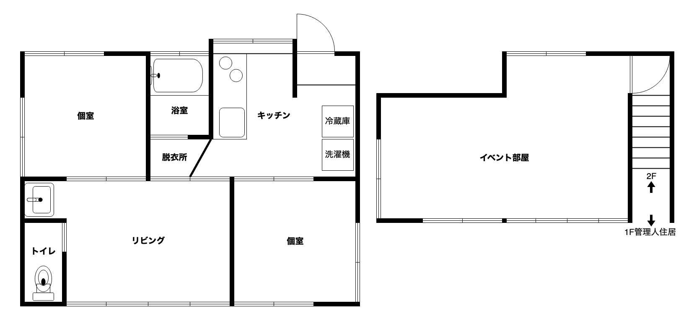

　
<!-- 1行目の全角スペースの空行は消さずに保持しておくこと。これがあると _config.yml の title に従ってヘッダが生成される -->

## お知らせ
(2021/11/24) 家賃を水道光熱ネット費等込み月額38000円に変更しました  
~~(2021/10/19) 家賃を月額32000円に変更しました~~  
(2021/9/6) ドミトリーを廃止し個室のみとなります  
(2021/9/6) 入居要件に新型コロナウイルスワクチンの接種状況もしくは接種意思を加えました  

## アクセス
最寄駅：流山おおたかの森駅（つくばエクスプレス、東武野田線）
* 秋葉原から25分(快速)～30分(普通)。全列車種別停車
* 駅から徒歩20分
  * または東武バス4分、駒木下車徒歩5分（江戸川台駅東口行き、柏の葉キャンパス駅西口行き）

[周辺地図](https://drive.google.com/open?id=1WKVXbXgkUtFrii1tMolxQxDgWRo-SJ-_&usp=sharing)（住所詳細は非公開）

## 募集状況／入居状況
(2021/9/6)
* 入居者募集2名（個室2室）
* 現在入居者なし
* 管理人は隣地に居住

<!-- 現在満室ですが、内見は受け付けています。内見に来られた方には空きができた際にご連絡いたします。 -->

<!--
## 入居可能時期
* 要相談
  * 現在、修繕およびドミトリーの個室への転換作業を行なっているため、入居時期は事前にご相談ください（入居まで2週間〜1ヶ月程度要する可能性があります）。
-->

## 料金
* 家賃：個室4.5畳
  * 月額38000円（水道光熱ネット費、トイレットペーパー等の費用を含む[^1]）
* 保証金（デポジット）
  * 家賃1ヶ月分
  * 汚損などがなければ退去時に返却します

[^1]: 水道光熱ネット費、トイレットペーパーの他、共用部分の清掃に必要な消耗品の費用を含みます。

## 間取り
* 個室4.5畳x2
* リビング6畳
* キッチン4.5畳
* 風呂
* トイレ（温水洗浄便座付き）
* イベント部屋10.5畳（現在階段側半分のみ使用可・隣接する管理人住居の2F）

## 設備等
* インターネット接続（Wifi接続、光回線）
* スマートロック
* システムキッチン（ビルトイン食洗機、IHクッキングヒーター）
* 冷蔵庫、電子レンジ、炊飯器、ドラム式洗濯乾燥機
* エアコン（個室、リビング）
* ガスファンヒーター（リビング）
* ルンバ
* 40インチ4Kテレビ（4K Ultra HD Blu-ray 再生環境あり）
* ホワイトボード
* 自転車
* [書籍](https://booklog.jp/users/geetakanomori)

## 入居要件

### 必須要件
* DQNでない
* 家賃を滞納せずに払える
* 基本的なマナーが守れる
* 運営に協力できる
* 身の回りを清潔に保つことができる
* 喫煙しない
* ネット上で連絡が取れる
* Bluetooth4.0を搭載したiOS 8.0以上、Android 4.3以上のスマホ（スマートロック利用のため）
* 身分が証明できるものを提出できる (住民票、免許、パスポート、保険証など)
* 大騒ぎしない
* 新型コロナウイルスワクチンを2回接種済み、または接種可能になり次第速やかに2回接種を行う

### 推奨要件
* コンピューターやインターネットが好き
* IT関係の仕事、学校、趣味
* 荷物が少ない
* きれい好き
* ギークっぽい何かの能力がある、またはギークっぽい能力を身に付けようという意欲がある

## 連絡先
Twitter: [@geetakanomori](https://twitter.com/geetakanomori)  
Email: geetakanomori＠gmail.com （＠を@に変えてください）

入居、内見などのお問い合せは上記TwtterのDMかメールで  
（TwitterのDMはメッセージリクエストの通知が来ないので、メンションもしていただけると助かります）

## 関連リンク
[ギークハウスプロジェクト](http://geekhouse.tumblr.com/)
